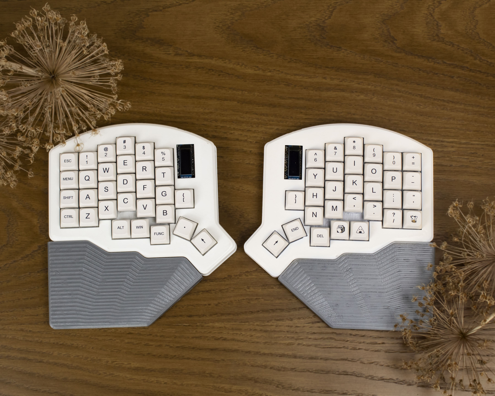
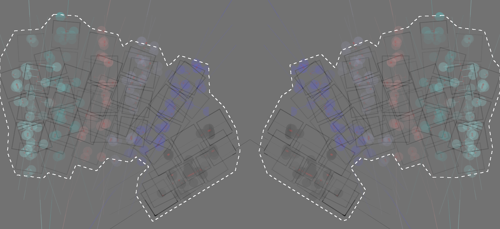
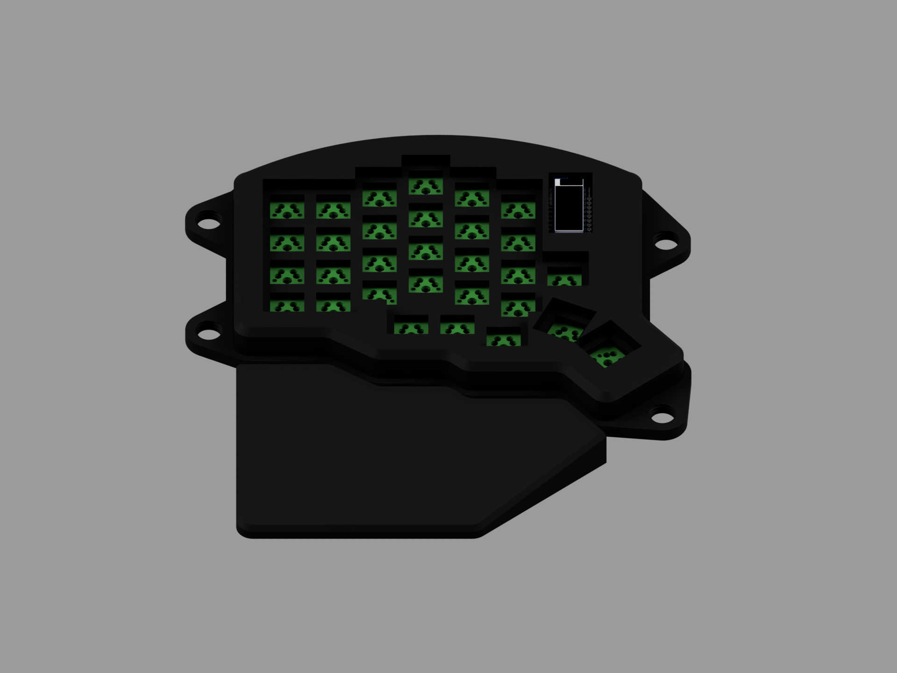

# Moon60

---

Moon60 is is a split keyboard with 4x6 column staggered keys, 5 thumb keys and 1 extra key.

Moon60 layout was inspired by hands scans from Ergopad (https://github.com/pashutk/ergopad) for matrix visualization. Scans were taken from 20 people and merged into subgroups.
 

#### Hand scans examples

 

#### CAD render

