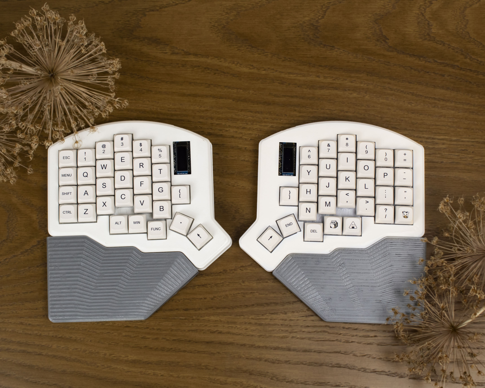

# Opis projektu klawiatury biometrycznej - Moon60

## Autorzy: Przemek Paciorek, Damian Pryszcz

Wraz z myślą i potrzebami dzisiejszego rynku stworzyliśmy projekt wszechstronnej klawiatury dostosowywanej pod użytkownika.

Dzisiejszy świat opiera się na rozwoju technologii. W wielu jej dziedzinach używane są klawiatury, które na dłuższą metę użytkowania mogą być niebezpieczne. Najpopularniejsze klawiatury, które dominują rynek nie są tworzone z myślą o ergonomii nadgarstków. To właśnie one są najbardziej nadwyrężane w czasie użytkowania klawiatury. Niewłaściwe ułożenie nadgarstków i napięcie jakie wymusza na nas pozycja w której je układamy może wywołać np. zespół cieśni nadgarstka. Również osoby z różnymi dysfunkcjami mogą mieć problemy z użytkowaniem tej jakże potrzebnej części technologii.

W tym celu stworzyliśmy projekt nazwany bazowo **Insequor58**, lecz został on zmodyfikowany i przeniesiony do nazwy **Moon60**. Projekt stworzony został w celu poprawienia ergonomii ułożenia nadgarstków i zmniejszenia ich napięcia, jak i ułatwieniu użytkowania klawiatury przez osoby z dysfunkcjami. Projekt ma za zadanie również zapewnić użytkownikowi możliwie w jak największym stopniu dostosowanie klawiatury pod swoje potrzeby.

### Opcje dostosowania:

- Rozdzielna budowa pozwala na dostosowanie szerokości rozstawu nadgarstków.
- Ułożenie sekcji klawiszy jest zrobione w taki sposób aby zminimalizować ruch nadgarstka.
- Szeroka gama wyboru przełączników pozwala na dostosowanie wysokości jak i odczuć płynących z pisania.
- Podstawka pod nadgarstki wyrównuje napięcie dłoni i podtrzymuje je w jednym miejscu.
- "Tenting", czyli podniesienie poziome klawiatury pozwala na dostosowanie kątu pisania i co za tym idzie ustawienia nadgarstków w bardziej naturalnej pozycji.

### Wykorzystane komponenty:

- Własnoręcznie zaprojektowane PCB
- Diody półprzewodnikowe
- Arduino pro-micro
- Wyświetlacze OLED
- Przełączniki mechaniczne
- Moduły Hot-swap

Dzięki zastosowaniu odpowiedniego firmware klawiatura jest podzielona na dwie części. Wykorzystuje komunikację poprzez przewód TRRS.

"Tenting" i podpórka pod nadgarstki będą modułami magnetycznymi, a do produkcji obudowy i tych komponentów użyliśmy oprogramowania CAD CAM i drukarki 3D.

Mapa i funkcjonalność przycisków została przystosowana do jak najszybszej pracy w wielu dziedzinach. Obecnie do programowania, lecz planujemy rozwój w innych kierunkach.

W przyszłości klawiatura będzie miała możliwość przypisania dowolnych klawiszy w "locie", czyli poprzez wyświetlacz i wgrany na nią firmware, jak i również wyświetlania:

- prędkości pisania
- poziomu ekploatacji komponentów komputera
- efektów graficznych

Planujemy dalszy złożony rozwój projektu i liczymy na liczne rezultaty.
